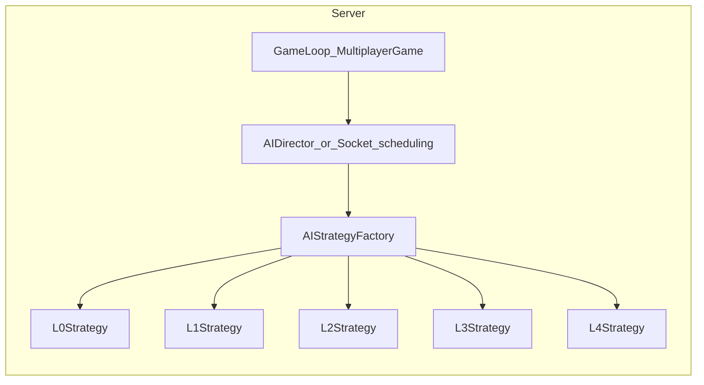

# AI玩家匹配机制设计文档

> 版本：v1.1  
> 日期：2026-03-25  
> 状态：已确认；AI 策略分级规格已增补（§5.3–§5.5）

---

## 一、功能概述

### 1.1 设计目标

让玩家可以快速开始游戏，系统自动匹配其他玩家，空位由AI填充。

### 1.2 功能兼容性

| 功能 | 状态 |
|------|------|
| 原有开房间/加房间 | ✅ 保留 |
| 快速匹配（新增） | ✅ 新增 |

---

## 二、大厅界面改造

### 2.1 界面布局

```
┌────────────────────────────────────────────────────┐
│  ┌──────────┐                                      │
│  │  头像    │   御魂传说                           │
│  │ 120×120  │   百鬼夜行                           │
│  │ 随机色块 │                                      │
│  └──────────┘   ● 已连接 1ms                       │
│  玩家昵称                                          │
│                                                    │
│  ┌────────────────────────────────────────────┐   │
│  │          [原有房间列表区域]                 │   │
│  │                                            │   │
│  └────────────────────────────────────────────┘   │
│                                                    │
│  在线人数: 12                     【开始游戏】     │
└──────────────────────────────────────────────────┘
```

### 2.2 新增元素

| 位置 | 元素 | 说明 |
|------|------|------|
| **左上角** | 玩家头像 | 120×120随机色块图片 |
| **左上角** | 玩家昵称 | 显示当前玩家名称 |
| **左下角** | 在线人数 | 显示所有连接服务器的Socket数量 |
| **右下角** | 【开始游戏】按钮 | 点击后进入匹配队列 |

---

## 三、匹配流程状态机

### 3.1 状态图

```
┌─────────┐                ┌─────────────┐                ┌─────────────┐
│  大厅   │ ──点击开始──→ │  匹配中     │ ──10秒到────→ │  确认阶段   │
│  LOBBY  │               │  MATCHING   │                │  CONFIRM    │
└─────────┘               └─────────────┘                └─────────────┘
     ↑                          │                              │
     │         退出匹配         │                              │
     └──────────────────────────┘                              │
     ↑                                                         │
     │    放弃/超时(10s)/人数<3/真人=0                         │
     └─────────────────────────────────────────────────────────┘
                                                               │
                            所有真人确认 + 人数≥3 + 真人≥1     │
                                                               ↓
                                                    ┌─────────────┐
                                                    │  游戏中     │
                                                    │  IN_GAME    │
                                                    └─────────────┘
```

### 3.2 状态说明

| 状态 | 英文 | 说明 |
|------|------|------|
| 大厅 | `LOBBY` | 默认状态，可浏览房间或开始匹配 |
| 匹配中 | `MATCHING` | 等待其他玩家加入 |
| 确认阶段 | `CONFIRM` | 匹配成功，等待所有真人确认 |
| 游戏中 | `IN_GAME` | 正式开始游戏 |

---

## 四、各阶段详细规则

### 4.1 匹配阶段（MATCHING）

| 项目 | 规则 |
|------|------|
| **UI展示** | 动态提示 + 递增计时器(0s→10s) |
| **按钮** | 【退出匹配】 |
| **分数** | 当前所有玩家/AI初始1000分 |
| **匹配时长** | 固定10秒（后续可扩展动态放宽） |
| **匹配完成** | 优先真人，空位用AI填充，凑满6人 |

#### 匹配阶段UI示例

```
┌────────────────────────────────────┐
│                                    │
│        ◉ 匹配中...                 │
│                                    │
│           5 秒                     │
│                                    │
│       【退出匹配】                 │
│                                    │
└────────────────────────────────────┘
```

### 4.2 确认阶段（CONFIRM）

| 项目 | 规则 |
|------|------|
| **UI展示** | 匹配成功提示 + 倒计时(10s→0s) |
| **按钮** | 【确认】【放弃】 |
| **AI处理** | 自动确认，无需等待 |
| **真人超时** | 10秒未确认自动踢出（不用AI替补） |
| **开局判定** | 所有真人确认 + 总人数≥3 + 真人≥1 |
| **匹配失败** | 人数<3 或 真人=0 → 全员返回大厅 |

#### 确认阶段UI示例

```
┌────────────────────────────────────┐
│                                    │
│        ✅ 匹配成功！               │
│                                    │
│   玩家1 ✓   玩家2 ...   机器人1 ✓  │
│   机器人2 ✓  机器人3 ✓  机器人4 ✓  │
│                                    │
│           倒计时 8 秒              │
│                                    │
│     【确认】      【放弃】         │
│                                    │
└────────────────────────────────────┘
```

### 4.3 人数规则

| 规则 | 值 | 说明 |
|------|-----|------|
| 最大玩家数 | 6人 | 固定6人局 |
| 最小玩家数 | 3人 | 低于3人匹配失败 |
| 最少真人数 | 1人 | 不允许纯AI对局 |

### 4.4 确认阶段场景示例

| 场景 | 结果 |
|------|------|
| 2真人+4AI → 2真人都确认 | ✅ 6人局开始 |
| 2真人+4AI → 1真人放弃 | ✅ 5人局（1真人+4AI） |
| 2真人+4AI → 2真人都放弃 | ❌ 匹配失败（真人=0） |
| 1真人+5AI → 1真人确认 | ✅ 6人局开始 |

---

## 五、AI玩家设计

### 5.1 AI基础信息

| 项目 | 规则 |
|------|------|
| **昵称** | "机器人1"、"机器人2"... |
| **头像** | 120×120随机色块（与真人一致） |
| **初始分数** | 1000分 |
| **座位顺序** | 无左右位置概念，各自独立 |

### 5.2 AI策略层级

| 层级 | 名称 | 说明 | 状态 |
|:----:|------|------|:----:|
| **L0** | 随机 | 随机选择合法动作（仅测试用） | - |
| **L1** | 规则 | 按固定优先级执行 | ✅ 当前实现 |
| **L2** | 启发 | 考虑当前局面做简单判断 | 🔜 未来扩展 |
| **L3** | 搜索 | 评估多步后果 | 🔜 未来扩展 |
| **L4** | 学习 | 基于历史数据优化 | 🔜 未来扩展 |

**约定：`L0` 是否进入对外快速匹配** —— 默认 **不进入**；仅用于自动化、压力测试、GM/调试房间。正式匹配池填充的 AI 默认 **`L1`**（与当前服务端一致）。类型与代码侧若增加 `L0`，与 `PlayerState.aiStrategy` / `AIPlayerConfig.level` **需统一枚举**（实现见 Phase 2）。

### 5.3 分级维度与决策切面

#### 5.3.1 分级维度（各层对照）

以下维度用于评审「某档 AI 该怎么表现」，避免口头约定歧义。**信息集**默认与服务端一致：**可读完整 `GameState`**（不全信息对弈另立项）。任意层级均须 **规则合法**，非法动作不得入选。

| 维度 | L0 | L1 | L2 | L3 | L4 |
|------|----|----|----|----|-----|
| **信息集** | 全状态 | 全状态 | 全状态 | 全状态 | 全状态（或离线训练用增强特征） |
| **目标倾向** | 压测覆盖、均匀探索合法空间 | 合规 + 固定优先级 + **均匀随机**（含故意不省伤害） | 合规 + **启发式加权**（仍可有随机项） | 单回合/短 horizon **近似最优** | 数据/自对弈得到的策略或价值函数 |
| **搜索深度** | 0（单步采样） | 0 | 0（无前瞻） | 有限（如当前回合内牌序 × 伤害分配 Top-K） | 训练时任意；**在线**仅查表或轻量推理 |
| **随机性** | 合法动作均匀随机 | 关键分叉 **均匀随机**（见 §6.2） | **加权随机** 或「优先级 + tie 随机」 | 主分支择优，**平局随机**或限定随机防过度确定性 | 由策略网络或分布导出 |
| **行动延迟** | 可配（测试可无延迟） | `random(1,2)` 秒/动（§6.2） | 同 L1，除非文档另订 | 允许略长，但须 **时间盒**（见 §5.4 L3） | 在线须低延迟 |

#### 5.3.2 决策切面矩阵

同一局面下各层在「合法集内」的偏好对照（**L1 以 §6 为准**，下表 L1 列为摘要）。**原则**：L1 保持「均匀随机 + 不刻意省伤」的新手友好与可测性；**L2 起** 允许启发式，但与 L1 的「非最优随机」**明确区隔**（L2 = 加权随机 / 优先级，而非 L1 的纯均匀）。

| 切面 | L0 | L1（详见 §6） | L2（规划示例） | L3（规划示例） | L4（规划示例） |
|------|----|---------------|----------------|----------------|----------------|
| **式神选择** | 从展示列表随机选 2 | 固定选展示顺序 **前 2 张** | 简单打分：如稀有度、技能关键词与场面契合度，取 Top2 | 浅层比较 2～3 种组合的单步收益 | 查策略表 / 网络输出 |
| **打牌循环** | 随机选一张可打出（若规则允许打） | **有则可打则打满**，否则再退治/结束（§6.2 循环） | 规则队列：如先打「不钥匙牌/低费」、保留 key 牌等（仍为启发式） | 枚举有限出牌序列，估值最高者（时间盒内） | 学习所得序列表 |
| **伤害分配 / 可调度的退治前击杀** | 随机合法目标与合法分配步 | **可击杀集合内均匀随机**，**允许溢出浪费**（§6.2） | **加权随机**：如权重 ∝ 声誉、∝ 1/(浪费量+ε)，仍保留随机项 | 在当前伤害池与场上状态下 **最小浪费** 或限定深度的最优分配 | 学习权重或端到端 |
| **二选一 `onChoice`** | 随机 | **第一项**（§6.2） | 按效果类型写简单规则表（如资源紧张选省手牌） | 与单步评估挂钩 | 数据驱动 |
| **目标 `onSelectTarget`** | 随机合法 | **均匀随机**合法目标 | 加权随机（如优先低 HP 省伤，与 L1 区分） | 择优 + tie-break | 数据驱动 |
| **弃牌 `onSelectCards`** | 随机合法 | **HP 最低**（§6.2） | 可改为「效用最低/最高」与局面挂钩 | 与评估函数一致 | 数据驱动 |
| **超度 `salvageChoice`** | 随机或固定概率 | **默认不超度**（§6.2） | 小概率超度或按牌库顶类型规则 | 期望收益符号决定 | 数据驱动 |

### 5.4 各层规格摘要与控制边界

- **L0**：任意 **合法** 动作上 **均匀随机**；用于自动化、压力测试及复现边界。**不进入** 默认快速匹配池（见上节约定）。
- **L1**：与 **§六** 完全一致；不再在本节重复定义。实现与验收均以 §6 为准。
- **L2**：**零前瞻**；以局面特征（手牌结构、伤害池、场上 HP、声誉等）驱动的 **固定规则表 + 加权随机**。适合 Phase 2 首个 AI 增强里程碑；复杂度与算力可控。
- **L3**：在 **单回合或短序列** 内做 **有限深度搜索/模拟**（例如出牌顺序 × 伤害分配），目标为近似最小浪费或最大单轮声誉。**必须**：服务端侧 **时间盒**（建议初始如 50～200ms/决策，可配置），超时 **降级** 为 L2 启发式，再不行 **降级** 为 L1 均匀随机，保证不断线、不卡回合。
- **L4**：**离线** 自对弈、日志监督学习或强化学习，产出 **策略表、价值网络或浅层模型**；在线仅 **推理/查表**。策划文档只约定 **范围与接口**（输入状态摘要、输出动作分布或 argmax），不绑定具体算法与训练管线细节；**独立立项**，依赖数据基建与版本管理。

### 5.5 与游戏规则的一致性

- 所有层级的 **合法性** 以 [游戏规则说明书.md](./游戏规则说明书.md) 与 [界面ass/信息交互.md](./界面ass/信息交互.md) 为准；分级只改变 **合法集内的偏好与随机机制**，AI **不得** 获得人类不可见的隐藏信息（除非未来单独定义「信息不对称模式」）。
- **L1** 的「伤害与退治的非最优随机」**不适用于 L2+** 的启发式描述：L2+ 可以倾向省伤害或追声誉，但须在 **§5.3.2** 与实现注释中与 L1 区分，避免策划与程序理解冲突。

---

## 六、AI行为规则（L1策略）

### 6.1 式神选择阶段

| 规则 | 说明 |
|------|------|
| 策略 | 选择前2个式神 |
| 等待时间 | 无额外等待，立即选择 |

### 6.2 回合行动

#### 行动原则（L1）

| 原则 | 说明 |
|------|------|
| **优先打空手牌** | 只要仍存在**任意一张**在当前局面下**可合法打出**的手牌，AI 应继续尝试打牌，而不是提前进入退治或结束回合。「打完能打的」优先于其他非结束类行动。 |
| **伤害与退治的非最优随机** | 在分配本回合累计伤害、或对已击杀单位执行退治等需要「在多个合法目标中选一个」的环节，L1 **不做**「尽量少浪费伤害」或「最优组合」式的凑数；应在**合法目标集合内均匀随机**（或使用等价随机策略）。**允许伤害溢出**：例如本回合累计可分配伤害为 5，场上有剩余 HP 为 2、3、4 的游荡妖怪均可被本轮击杀时，AI 可能随机选择先对 **4 HP** 的目标击杀并造成 **1 点浪费**，而不会刻意优先凑 2+3。 |

#### 行动循环

```
┌─────────────────────────────────────────────────┐
│              AI 回合行动循环（L1）                 │
│                                                 │
│  1. 检查手牌是否有可打出的牌                     │
│     ├─ 有 → 随机选一张打出 → 等待1-2秒 → 回到1  │
│     └─ 无 → 进入步骤2                           │
│     （步骤1为高优先级：尽可能打光可打之牌）       │
│                                                 │
│  2. 检查场上是否有可退治的妖怪                   │
│     ├─ 有 → 在合法集合中随机选一个退治 →        │
│     │        等待1-2秒 → 回到1                 │
│     └─ 无 → 进入步骤3                           │
│                                                 │
│  3. 结束回合                                    │
└─────────────────────────────────────────────────┘
```

> **伤害分配**：当需要将「当前累计伤害」分配到场上目标时，具体选目标与分配量须遵守本节「伤害与退治的非最优随机」——随机指向可击杀分支，而非最小浪费或固定从小到大拆分。

#### 行动节奏

| 项目 | 值 |
|------|-----|
| 每次动作间隔 | `random(1, 2)` 秒 |
| 视觉提示 | 无（与真人一致） |

#### 卡牌效果选择规则

| 效果类型 | L1策略 |
|----------|--------|
| 二选一(`onChoice`) | 选择第一个选项 |
| 目标选择(`onSelectTarget`) | **均匀随机**合法目标（与「非最优随机」一致；不得为省伤害而固定择优） |
| 弃牌选择(`onSelectCards`) | 选择HP最低的牌 |
| 超度选择(`salvageChoice`) | 默认不超度 |
| **本回合伤害池指向** | 在能击杀的合法目标中**随机**决定攻击对象与分配次序，允许溢出浪费 |

### 6.3 确认阶段

| 规则 | 说明 |
|------|------|
| 策略 | 自动确认，无需等待 |

---

## 七、技术实现要点

### 7.1 服务端模块与 AI 分层架构

| 模块 | 说明 |
|------|------|
| `MatchQueue` | 匹配队列管理 |
| `AIPlayer` | AI 玩家外壳：延迟、身份、与 socket/房间绑定；**具体决策委托** `AIStrategy` |
| `AIStrategy` | **策略引擎接口**：按 `PlayerState.aiStrategy`（`L0`～`L4`）由工厂注入实现类；各层仅替换「评分/搜索/随机源」 |
| `AIStrategyFactory`（建议） | `create(strategy: AiStrategyLevel): AIStrategy`；超时降级时返回低阶策略实例 |

**单一调度入口（约定）**：`allocateDamage`、`playCard`、`endTurn`、`handleRetireYokai` / 超度选择，以及所有 **`pendingChoice`**（`onChoice`、`onSelectTarget`、`onSelectCards`、`salvageChoice` 等）的 AI 响应，均应走 **同一决策管线**（例如 `AIDirector.decide(state, playerId, context)`），由当前玩家的 `AIStrategy` 产出动作；避免在 `SocketServer` / `MultiplayerGame` 内散落 if-else 硬编码各层逻辑。

**匹配默认层级**：当前填充机器人的 **`aiStrategy` 固定为 `L1`**（与仓库实现一致）。Phase 2 可扩展：**段位/分数 → 默认 L2**、测试房指定 L0、高端房 L3 等。



### 7.2 Socket事件新增

| 事件 | 方向 | 说明 |
|------|------|------|
| `match:start` | C→S | 开始匹配 |
| `match:cancel` | C→S | 取消匹配 |
| `match:status` | S→C | 匹配状态更新 |
| `match:found` | S→C | 匹配成功，进入确认 |
| `match:confirm` | C→S | 确认参加 |
| `match:decline` | C→S | 放弃参加 |
| `match:ready` | S→C | 所有人确认，即将开始 |

### 7.3 状态字段新增

```typescript
/** 与实现对齐时建议统一为同一字面量联合（含可选 L0） */
type AiStrategyLevel = 'L0' | 'L1' | 'L2' | 'L3' | 'L4';

interface PlayerState {
  // ... 现有字段
  isAI: boolean;                  // 是否为 AI 玩家
  aiStrategy?: AiStrategyLevel;   // 非 AI 可省略；匹配填充 AI 当前为 L1
}
```

说明：历史上 `shared` 类型可能仅为 `'L1'|'L2'|'L3'|'L4'`；**增补 `L0`** 时须同步 `AIPlayerConfig.level`、`MultiplayerGame` 创角与 `AIStrategyFactory`，并以本文 **§5** L0 约定为准。

---

## 八、开发计划

### Phase 1: 基础框架

- [x] 大厅界面改造（头像、昵称、在线人数、开始游戏按钮）
- [x] 匹配队列服务端逻辑
- [x] 匹配中/确认阶段 UI
- [x] AI 玩家基础框架（`AIPlayer` / 调度挂钩）
- [x] AI 式神选择（L1）
- [x] AI 回合行动（L1，对齐 §六）

### Phase 2: 优化迭代

- [ ] 分数匹配算法
- [ ] 动态放宽匹配区间
- [ ] **AI L2**：启发式模块 + 加权随机；固定局面单元测试（合法 + 行为倾向可断言）+ 与 L1 对照回退
- [ ] **AI L3（可选）**：有限深度搜索 + **时间盒**与 **L2→L1 降级链**；复杂度与超时监控
- [ ] **AI L4**：独立立项（数据日志、自对弈管线、模型版本与在线推理接口）
- [ ] 类型与配置 **统一 `AiStrategyLevel`（含 L0）**；`AIStrategy` 接口 + 工厂；`MultiplayerGame` 按 `aiStrategy` 分支（当前均为 L1）
- [ ] 断线重连与 AI 接管

---

## 九、相关文档

- [卡牌开发.md](./卡牌数据/卡牌开发.md) - 卡牌效果AI策略参考
- [游戏规则说明书.md](./游戏规则说明书.md) - 游戏规则参考

---

> ✅ 文档 v1.1：匹配与 L1 行为仍可开发迭代；AI **分级规格**（§5.3–§5.5、§7.1）作为 L2+ 与类型统一的依据。
